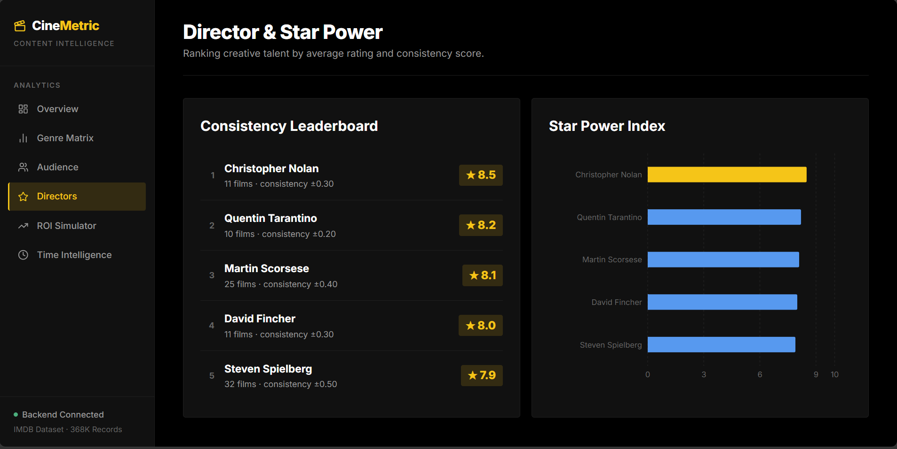

#  CineMetric - Task-3 (IMDB Dataset Analysis)
## Enterprise Content Intelligence Dashboard


> **CineMetric** transforms 368,000+ IMDB records into actionable acquisition signals — helping OTT platforms, studios, and content analysts make data-driven greenlighting decisions.

---

##  UI Preview

### Landing Page


### Six Intelligence Modules


---

##  Dashboard Pages

### 1. Executive Overview

> High-level KPI cards: 9,739 curated titles · Global Avg Rating 5.98 · Top Genre: Drama · Most Voted: The Dark Knight. Includes a full Content Quality Trend line chart from 1917 to 2026.

---

### 2. Genre Intelligence (BCG Matrix)

> Every genre plotted across a 4-quadrant BCG scatter chart — **Stars** (Gold), **Cash Cows** (Blue), **Niche Gems** (Purple), **Dogs** (Red) — mapped by Production Volume vs. Average Rating.

---

### 3. Audience Engagement

> Votes vs. Rating scatter with certificate-based coloring ( G ·  PG-13 ·  R). Right panel shows Certificate Effect — R-rated films attract 3.7× more votes than G-rated titles.

---

### 4. Director & Star Power

> Consistency Leaderboard ranking top directors by average rating and output volume. Star Power Index horizontal bar highlights Christopher Nolan at ★ 8.5 as the benchmark.

---

### 5. Content ROI Simulator (ML)

> Input Genre + Runtime + Certificate → ML model returns a predicted IMDB rating and a **GREENLIGHT / CAUTION / AVOID** investment signal powered by a trained RandomForestRegressor.

---

### 6. Time Intelligence

> Decade-by-decade quality trend line across 12 decades. Peak Volume Era: **2010s** with 2,622 films. Avg rating peaked in the **1920s** at ~6.5 and has trended down as volume exploded.

---

##  Features

| Module | What It Does |
|---|---|
| **Executive Overview** | KPI cards + quality trend line chart |
| **Genre BCG Matrix** | 4-quadrant scatter: Stars / Cash Cows / Niche Gems / Dogs |
| **Audience Engagement** | Votes vs. Rating scatter colored by MPAA certificate |
| **Director Star Power** | Consistency leaderboard + Star Power Index bar chart |
| **Content ROI Simulator** | ML-powered rating prediction + Green/Yellow/Red signal |
| **Time Intelligence** | Decade-by-decade quality & volume trend analysis |

---

##  Tech Stack

| Layer | Technology |
|---|---|
| **Frontend** | React 18, Vite, TailwindCSS v4, Recharts, Axios |
| **Backend** | FastAPI, Uvicorn, Pandas, PyArrow |
| **Machine Learning** | Scikit-Learn (RandomForest), Joblib, NumPy |
| **Data Format** | Apache Parquet (processed), CSV (raw IMDB) |

---

##  Folder Structure

```text
CineMetric/
├── backend/                  # FastAPI Python application
│   └── main.py               # All API endpoints
├── Data/                     # Raw IMDB CSVs + processed Parquet file
│   ├── title.basics.csv
│   ├── title.ratings.csv
│   ├── imdb_top_1000.csv
│   └── processed_imdb_data.parquet
├── doc/                      # Project documentation & analysis report
│   ├── ANALYSIS_REPORT.md
│   └── CODEBASE_ANALYSIS.md
├── frontend/                 # Vite + React frontend
│   ├── src/
│   │   ├── pages/            # Dashboard page components
│   │   ├── components/       # Sidebar, Layout
│   │   ├── App.jsx
│   │   └── index.css         # Design system (IMDB-inspired dark palette)
│   └── package.json
├── images/                   # UI screenshots
├── models/                   # Serialized ML models (.joblib)
│   ├── certificate_imputer.joblib
│   ├── rating_predictor.joblib
│   └── mappings.joblib
├── preprocess_data.py        # End-to-end data pipeline + model training
└── README.md
```

---

##  Setup & Installation

### Prerequisites
- **Python** 3.9 or higher
- **Node.js** 18 or higher
- **npm** 9 or higher

---

### Step 1 — Clone the Repository

```bash
git clone https://github.com/allenjohn006/CineMetric.git
cd CineMetric
```

---

### Step 2 — Backend Setup

**Create and activate a virtual environment:**

```bash
# Create the virtual environment
python -m venv venv

# Activate (Windows)
.\venv\Scripts\activate

# Activate (Mac / Linux)
source venv/bin/activate
```

**Install Python dependencies:**

```bash
pip install fastapi uvicorn pandas scikit-learn pyarrow fastparquet joblib pydantic numpy
```

**Run the data preprocessing pipeline** *(only needed once — skip if `Data/processed_imdb_data.parquet` and the `.joblib` model files already exist)*:

>  Ensure `title.basics.csv`, `title.ratings.csv`, and `imdb_top_1000.csv` are placed inside the `Data/` directory before running.

```bash
python preprocess_data.py
```

This script will:
1. Merge the raw IMDB datasets
2. Train a **Certificate Imputer** (RandomForestClassifier) on the Top-1000 dataset to label the 368K records
3. Train a **Rating Predictor** (RandomForestRegressor) on the full processed dataset
4. Export `Data/processed_imdb_data.parquet` and all `.joblib` model files

---

### Step 3 — Frontend Setup

Open a new terminal and navigate to the `frontend` folder:

```bash
cd frontend
npm install
```

---

##  Running the Application

You need **two terminals running simultaneously**.

**Terminal 1 — Start the FastAPI Backend** (from the `CineMetric/` root):

```bash
# Make sure your venv is activated first
uvicorn backend.main:app --reload
```

The API will be available at: `http://127.0.0.1:8000`

**Terminal 2 — Start the React Frontend** (from the `CineMetric/frontend/` folder):

```bash
npm run dev
```

The dashboard will be available at: `http://localhost:5173`

Open your browser and navigate to **`http://localhost:5173`** to explore CineMetric.

---

##  API Endpoints

| Method | Endpoint | Description |
|---|---|---|
| `GET` | `/api/kpis` | Executive KPI data (totals, top genre, quality trend) |
| `GET` | `/api/genre-matrix` | BCG Matrix data (volume vs rating by genre) |
| `GET` | `/api/audience-engagement` | Votes vs. Rating scatter + certificate effect |
| `GET` | `/api/directors-stars` | Director leaderboard and star power index |
| `GET` | `/api/time-intelligence` | Decade-by-decade quality and volume trend |
| `POST` | `/api/predict-roi` | ML rating prediction (Genre + Runtime + Certificate) |

---

## 📊 Data Analysis Highlights

Key findings from the 368,000-record IMDB dataset (see `doc/ANALYSIS_REPORT.md` for the full report):

- **Drama dominates** with the highest production volume (2,800+ films) — a true Cash Cow genre
- **Documentary is a Star** — high average rating (≈7.1) with significant volume
- **R-rated films attract 3.7× more votes** than G-rated content (12,617 vs 3,360 avg votes)
- **Content quality peaked in the 1920s** (avg rating ~6.5) and has declined as volume scaled up
- **2010s was the peak production decade** with 2,622 films — highest in history
- **Christopher Nolan** leads the Director Star Power Index with ★ 8.5 avg rating across 11 films

---

##  Documentation

Detailed documentation is in the `/doc` folder:

- [`ANALYSIS_REPORT.md`](doc/ANALYSIS_REPORT.md) — Full EDA findings, insights, and business recommendations
- [`CODEBASE_ANALYSIS.md`](doc/CODEBASE_ANALYSIS.md) — Architecture, API reference, and ML pipeline details

---

##  Author

**Allen John Isac** — Internship Task 2: IMDB Dataset Full-Stack + ML Dashboard

---

##  License

This project is built for educational and internship purposes using publicly available IMDB data.
